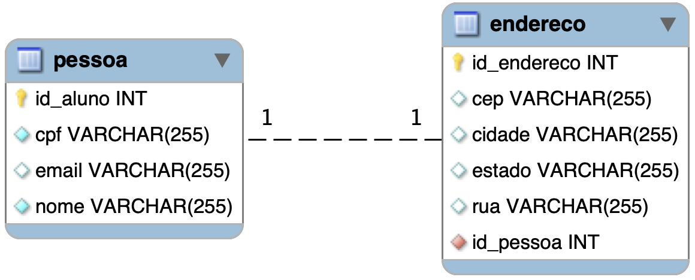

# Exemplo JPA com um relacionamento um-para-um


Abaixo é apresentado do diagrama ER do modelo relacional do exemplo presente neste diretório. Trata-se de um exemplo simples para permitir observar como os atributos das classes Java serão mapeados para as colunas em uma tabela no MySQL e como criar um relacionamento um-para-um entre Pessoa e Endereço.

Cabe frisar que a cardinalidade máxima **um-para-um** só será respeitada se na coluna `id_pessoa` da tabela Endereço for criada uma restrição UNIQUE (ou INDEX) e isto é feito automaticamente pelo JPA quando se usa a anotação `OneToOne`.



## Servidor MySQL

Para executar esse exemplo é necessário que tenha um servidor MySQL disponível. Você subir um rapidamente dentro de contêiner com o Docker. Basta executar a linha abaixo:

```bash
docker run -d --rm -p 3306:3306 -e MYSQL_ROOT_PASSWORD=senhaRoot -e MYSQL_DATABASE=bcd -e MYSQL_USER=aluno -e MYSQL_PASSWORD=aluno -e MYSQL_ROOT_HOST='%' --name meumysql mysql/mysql-server:latest
```

Cabe lembrar que sempre que o contêiner for parado, ele será excluído (opção `--rm` no comando acima) e todos os dados serão perdidos. Se quiser que os dados continuem mesmo depois da parada e exclusão do contêiner, então passe o parâmetro `-v $(pwd)/db_data:/var/lib/mysql` que fará o mapeamento do diretório usado pelo MySQL no contêiner para um diretório no computador hospedeiro.

### Configuração do Spring para conexão com o banco de dados MySQL

Editar o arquivo [src/main/java/resources/application.properties](src/main/java/resources/application.properties) e incluir as informações sobre a conexão com o servidor MySQL.
```properties
spring.jpa.hibernate.ddl-auto=update
spring.datasource.url=jdbc:mysql://localhost:3306/bcd
spring.datasource.username=aluno
spring.datasource.password=aluno
spring.datasource.driver-class-name=com.mysql.cj.jdbc.Driver
```

A propriedade `spring.jpa.hibernate.ddl-auto` deve ser deixada com o valor `update` na primeira vez que for executar a aplicação. Isso fará com que as tabelas sejam criadas no MySQL. Uma vez que o modelo não mude mais, então seria interessante trocar de `update` para `none` e assim evitar que as tabelas sejam modificadas nas execuções subsequentes da aplicação.


## Executando o projeto

Abra a IDE e execute a classe [ExemploJpaApplication.java](src/main/java/engtelecom/bcd/ExemploJpaApplication.java) ou execute a tarefa gradle:

```bash
./gradlew bootRun
```