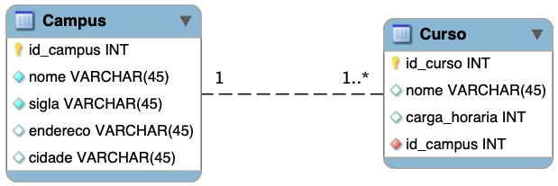

# Exemplo JPA com um relacionamento um-para-muitos


Editar o arquivo [src/main/java/resources/application.properties](src/main/java/resources/application.properties) e incluir as informações sobre a conexão com o servidor MySQL.
   ```properties
    spring.jpa.hibernate.ddl-auto=update
    spring.datasource.url=jdbc:mysql://localhost:3306/nome_do_database
    spring.datasource.username=nome-do-usuario
    spring.datasource.password=senha-do-usuario
    spring.datasource.driver-class-name=com.mysql.cj.jdbc.Driver
   ```

A propriedade `spring.jpa.hibernate.ddl-auto` deve ser deixada com o valor `update` na primeira vez que for executar a aplicação. Isso fará com que as tabelas sejam criadas no MySQL. Uma vez que o modelo não mude mais, então seria interessante trocar de `update` para `none` e assim evitar que as tabelas sejam modificadas nas execuções subsequentes da aplicação.

## Biblioteca Lombok

Neste exemplo foi feito uso da biblioteca [Lombok](https://projectlombok.org/) que tem por objetivo tornar a escrita de códigos Java mais ágil. Por exemplo, ao criar um POJO o desenvolvedor não precisará criar manualmente (mesmo que a IDE faça isso por ele) métodos `get` e `set`. Tudo isso pode ser obtido de forma automática, em tempo de compilação, por meio de anotações Java.

Caso não queira usar a biblioteca Lombok, então basta gerar os métodos obrigatórios para cada entidade JPA.

### Adicionando dependência no `build.gradle`

Adicione as linhas abaixo dentro da seção de dependências no arquivo [build.gradle](build.gradle):

```groovy
compileOnly 'org.projectlombok:lombok:1.18.22'
annotationProcessor 'org.projectlombok:lombok:1.18.22'

testCompileOnly 'org.projectlombok:lombok:1.18.22'
testAnnotationProcessor 'org.projectlombok:lombok:1.18.22'
```

### Adicionando plugins ou extensões em sua IDE

- **IntelliJ**
  - Vá em `File->Settings->Plugins`
  - Clique em `Browse repositories`
  - Procure por `Lombok plugin` e instale
  - Reinicie a IDE
- **Visual Studio Code**
  - Vá no painel de extensões, procure por `lombok` e instale a extensão [Lombok Annotations Support for VS Code](https://marketplace.visualstudio.com/items?itemName=GabrielBB.vscode-lombok)

## Modelo

Abaixo é apresentado do diagrama ER do modelo relacional do exemplo presente neste diretório. Trata-se de um exemplo simples para permitir observar como os atributos das classes Java serão mapeados para as colunas em uma tabela no MySQL e como criar um relacionamento um-para-muitos de Campus para Curso, que com JPA também requer que na classe Curso seja criado uma anotação muitos-para-um.



## Derivando métodos de consultas com Spring Data JPA

O Spring Data JPA permite executar diferentes tipos de consultas com base nos nomes de métodos da classe Entidade (*Derived Query Methods*). Para tal o nome do método é divido em dois componentes separados pelo delimitador `By`.

1. **Introdutor**
   - `find`, `read`, `query`, `count` ou `get` 
   - Indica ao Spring Data JPA o que você deseja fazer com o método e pode conter outras expressões, como o `Distinct`
2. **Critério**
   - Aparece após o delimitador `By` e é aquilo que determinar o critério de seleção das tuplas. O critério pode ser concatenado com as palavras `And` e `Or`.

### Exemplos

```java

// Listar todos os cursos que possuam o nome informado como parâmetro
List<Curso> findByNome(String nomeDoCurso);

// Listar todos os cursos que possuam o nome informado como parâmetro, porém sem que os nomes sejam repetidos
List<Curso> findDistinctByNome(String nomeDoCurso);

// Contar o total de cursos do campus informado como parâmetro
int countByCampus(Campus campus)
```

Outros exemplos foram colocados no arquivo [CursoRepository.java](src/main/java/engtelecom/bcd/repository/CursoRepository.java).


## Executando o projeto

Abra a IDE e execute a classe [ExemploJpaApplication.java](src/main/java/engtelecom/bcd/ExemploJpaApplication.java) ou execute a tarefa gradle:

```bash
./gradlew bootRun
```