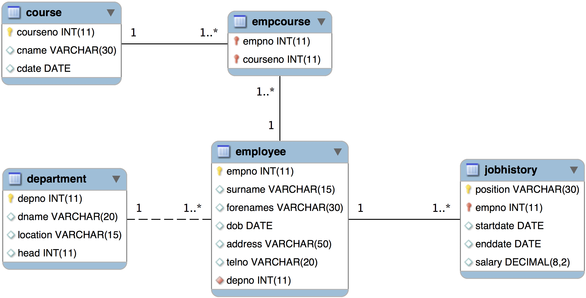

# Uso Spring Data JPA com um banco de dados existente

Este exemplo é para ser usado quando se tem um banco de dados já criado e assim não deseja que o mesmo seja criado por meio das entidades Java especificadas neste projeto. Sendo assim, foi necessário garantir que os nomes das entidades e seus atributos respeitassem os nomes das tabelas e colunas do banco de dados.

No arquivo [application.properties](src/main/resources/application.properties) é necessário indicar que não deseja modificar a estrutura do banco de dados. Isto é feito por meio da linha abaixo:

```properties
spring.jpa.hibernate.ddl-auto=none
```

Para executar este exemplo é necessário que você tenha um [servidor MySQL](../Readme.md#servidor-mysql) com um esquema criado a partir do arquivo [jobs-schema.sql](jobs-schema.sql) disponível neste repositório. 

Neste exemplo temos um modelo que relacionamentos muitos-para-muitos, um-para-muitos e uma chave primária composta (duas colunas), sendo que uma das colunas também é chave estrangeira.



## Consultas personalizadas com Query Annotation

No [Exemplo 02](../exemplo-02-um-para-muitos/Readme.md) deste repositório foi apresentado alguns exemplos para derivar métodos de consultas com Spring Data JPA. Neste diretório encontrará exemplo de consultas personalizadas usando a anotação `@Query` para fazer consultas SQL nativas (no caso, com o MySQL) e consultas com [*Java Persistence Query Language* (JPQL)](https://docs.oracle.com/cd/E12839_01/apirefs.1111/e13946/ejb3_langref.html).

Definida como parte da JPA, a JPQL é uma linguagem de consulta orientada a objetos e independente da plataforma, isto é, a mesma consulta escrita com JPQL poderá ser usada com MySQL, PostgreSQL, etc. A JPQL é fortemente inspirada na SQL, contudo é usada para interagir com objetos de entidades JPA e não diretamente com as tabelas no banco de dados.

### Exemplos

```java
// Lista de funcionários que fazem aniversário em um determinado mês
@Query("SELECT e FROM Employee e WHERE MONTH(e.dob) = ?1")
// A mesma query, porém usando consulta SQL nativa do MySQL
// @Query(value = "SELECT * FROM employee e WHERE MONTH(e.dob) = ?1", nativeQuery = true)
List<Employee> findByAniversariantesNoMes(int mes);
```


## Biblioteca Lombok

Neste exemplo foi feito uso da biblioteca [Lombok](https://projectlombok.org/), [veja mais detalhes aqui](../Readme.md#biblioteca-lombok).

## Executando o projeto

Abra a IDE e execute a classe [ExemploJpaApplication.java](src/main/java/engtelecom/bcd/ExemploJpaApplication.java) ou execute a tarefa gradle:

```bash
./gradlew bootRun
```