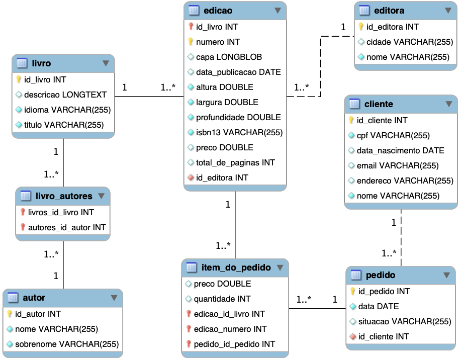

# Livraria

Neste exemplo é demonstrado o uso de 

- `Enum` (idioma do livro e situação do pedido)
- `@Embeddable` e `@Embedded` para indicar que a entidade `Dimensão` não terá uma tabela específica. Seus atributos serão incluídos na tabela gerada para a entidade `Edicao`
- `@EmbeddedId` para chave primária composta (entidade `Edição`)
- `@IdClass` quando se deseja um relacionamento muitos-para-muitos com chave estrangeira composta e quando se deseja ter colunas adicionais neste relacionamento
- Classe [`LivrariaRunner`](src/main/java/engtelecom/bcd/LivrariaRunner.java) tem toda a lógica da aplicação e seu método `run` é invocado assim que aplicação é executada.
  - Irá criar o esquema, povoar com alguns dados, listar os dados e depois alterar os valores de um pedido
- A anotação `@EqualsAndHashCode` do Lombok precisa excluir os atributos que são coleções e fazem parte de algum relacionamento. Ex: `@EqualsAndHashCode(exclude = {"livros"})` na classe [`Editora.java`](src/main/java/engtelecom/bcd/entities/Editora.java)

## Modelo



## Executando o projeto

Abra a IDE e execute a classe [LivrariaApplication.java](src/main/java/engtelecom/bcd/LivrariaApplication.java) ou execute a tarefa gradle:

```bash
./gradlew bootRun
```

## Biblioteca Lombok

Neste exemplo foi feito uso da biblioteca [Lombok](https://projectlombok.org/) que tem por objetivo tornar a escrita de códigos Java mais ágil. Por exemplo, ao criar um POJO o desenvolvedor não precisará criar manualmente (mesmo que a IDE faça isso por ele) métodos `get` e `set`. Tudo isso pode ser obtido de forma automática, em tempo de compilação, por meio de anotações Java.

Caso não queira usar a biblioteca Lombok, então basta gerar os métodos obrigatórios para cada entidade JPA e remover o plugin do lombok no arquivo [build.gradle](build.gradle).

### Adicionand extensão em sua IDE para suporte ao Lombok

- **IntelliJ**
  - Vá em `File->Settings->Plugins`
  - Clique em `Browse repositories`
  - Procure por `Lombok plugin` e instale
  - Reinicie a IDE
- **Visual Studio Code**
  - Vá no painel de extensões, procure por `lombok` e instale a extensão [Lombok Annotations Support for VS Code](https://marketplace.visualstudio.com/items?itemName=GabrielBB.vscode-lombok)
